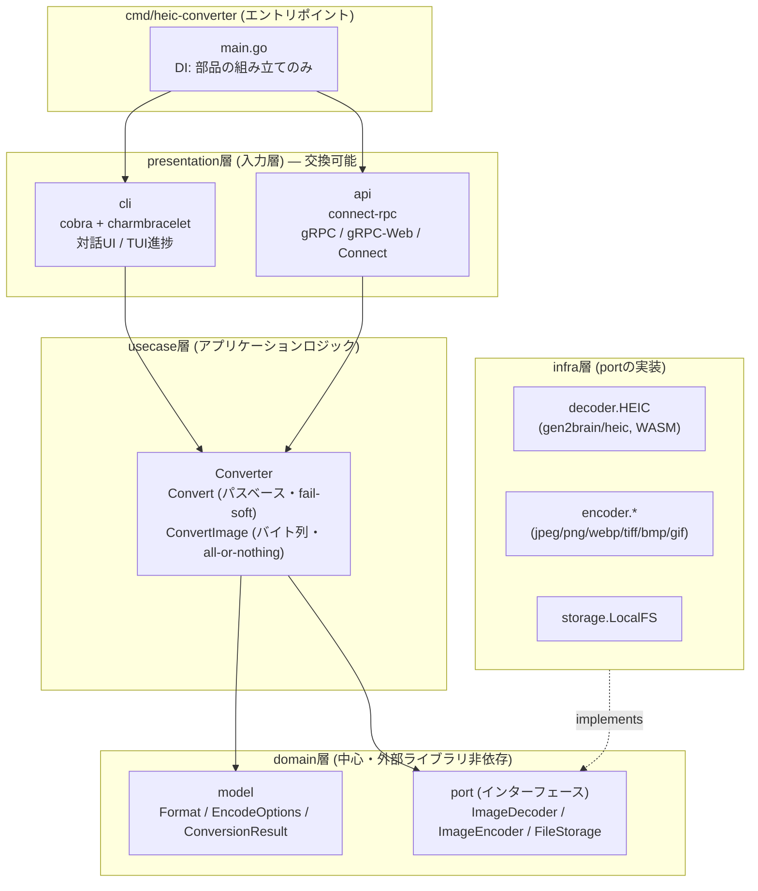
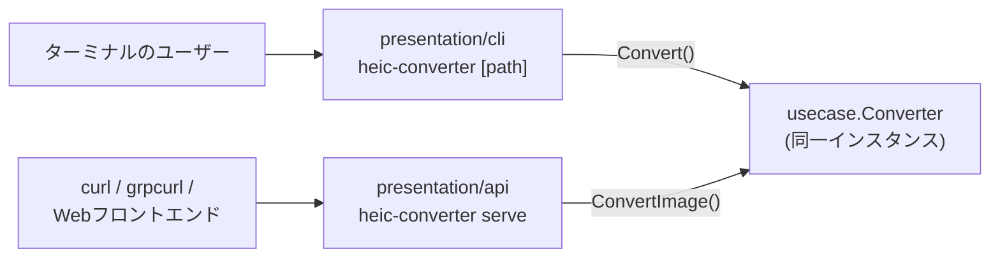
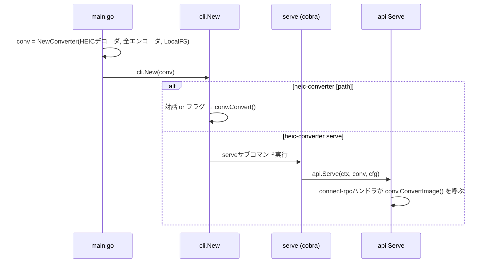

# アーキテクチャ解説 — クリーンアーキテクチャと入力層の抽象化

heic-converterの設計を振り返るためのドキュメント。特にこのプロジェクトの面白いところである
**「入力層(presentation)まで抽象化し、CLIとAPIを自由に切り替えられる」**点を中心に解説する。

## 1. 全体像



依存の向きはすべて**内側(domain)へ一方向**。domain層はどのレイヤーにも、どの外部ライブラリにも依存しない。

## 2. 依存ルール

| 層 | 依存してよいもの | 依存してはいけないもの |
|---|---|---|
| domain (model / port) | 標準ライブラリのみ | 他のすべての層・外部ライブラリ |
| usecase | domain | infra・presentation・具体的なライブラリ |
| infra | domain (portを実装) | usecase・presentation |
| presentation (cli / api) | usecase・domain/model | infra |
| cmd (main) | 全部 (DIのため) | — |

このルールにより:

- **infraの差し替え**: HEICデコーダのライブラリを変えてもusecase以上は無変更
- **presentationの差し替え**: CLIをAPIに変えてもusecase以下は無変更

## 3. 出力側の抽象化 — domainのportをinfraが実装する(定石)

domain層が「何が必要か」をインターフェース(port)として宣言し、infra層が「どうやるか」を実装する。
依存性逆転の原則(DIP)の定石パターン。

```go
// internal/domain/port/decoder.go — domainは「デコードできる何か」だけを要求
type ImageDecoder interface {
    Decode(r io.Reader) (image.Image, error)
    CanDecode(path string) bool
}
```

実装側はコンパイル時アサーションで「インターフェースを満たすこと」を保証する(このプロジェクトの規約)。

```go
// internal/infra/decoder/heic.go
var _ port.ImageDecoder = (*HEIC)(nil)
```

| port | 実装 | 差し替えの例 |
|---|---|---|
| `ImageDecoder` | `infra/decoder.HEIC` (gen2brain/heic, WASM実行でcgo不要) | libheif(cgo)版、AVIFデコーダの追加 |
| `ImageEncoder` | `infra/encoder` の6実装 (jpeg/png/webp/tiff/bmp/gif) | 新形式は1ファイル追加 + `encoder.All()` に登録 |
| `FileStorage` | `infra/storage.LocalFS` | S3・インメモリ(テスト用フェイク) |

usecaseのテストではportのフェイク実装を注入しており、実ファイルシステムやWASMデコーダなしで
ロジックだけを検証できている。これもportのおかげ。

## 4. 入力側の抽象化 — このプロジェクトの面白いところ

一般にクリーンアーキテクチャの説明は出力側(DB・外部API)の抽象化に偏りがちだが、
このプロジェクトは**入力層も差し替え可能な部品**として設計している。

鍵は2つ:

1. **presentation層はusecaseにのみ依存する** — cli / api どちらのパッケージも import するのは
   `usecase` と `domain/model` だけ。infraを知らない
2. **usecaseはプロトコル中立** — `Converter` はCLIのフラグもHTTPのステータスコードも知らない。
   入力は素朴なGoの型(`ConvertInput`, `io.Reader`, `[]model.Format`)、
   エラーは番兵エラー(`ErrInvalidInput` など)で意味だけを伝える

その結果、同じ `*usecase.Converter` を2つの入口が共有する:



### 4.1 各入力層の責務対応表

presentation層の仕事は「プロトコル固有の入出力 ⇔ usecaseの型」の変換に徹すること。
CLIとAPIで同じ関心事がどう対応しているかを並べると、入力層が薄いアダプタであることがわかる。

| 関心事 | cli | api |
|---|---|---|
| 入力の受け取り | cobraフラグ / huhの対話フォーム | protobufメッセージ (`ConvertRequest`) |
| 入力の検証・変換 | `buildInput()` → `ConvertInput` | `handler.Convert()` → `io.Reader` + `[]model.Format` |
| 呼ぶusecase | `Convert()` (パスベース) | `ConvertImage()` (バイト列ベース) |
| 結果の返し方 | ファイルに書き出し + サマリ表示 | レスポンスにバイト列を埋め込み(ステートレス) |
| エラーの表現 | exit code + stderrメッセージ | Connectエラーコード (`invalid_argument` など) |
| 進捗・観測 | `ProgressObserver` → bubbleteaのTUI | `loggingInterceptor` → slog構造化ログ |
| キャンセル | シグナル (Ctrl+C) → context | クライアント切断 / タイムアウト → context |

### 4.2 エラーマッピング — usecaseは「意味」だけを返す

usecaseは「呼び出し側の入力が悪い」ことを `ErrInvalidInput` という番兵エラーで表現し、
**どう報告するかはpresentationに委ねる**。

```go
// usecase側: 意味づけだけ行う
return nil, fmt.Errorf("%w: decode image: %v", ErrInvalidInput, err)
```

```go
// api側: プロトコルの語彙に翻訳する (handler.go の toConnectError)
case errors.Is(err, usecase.ErrInvalidInput):
    return connect.NewError(connect.CodeInvalidArgument, err)
```

CLIは同じエラーをそのままstderrに表示して非0で終了する。
usecaseにHTTPステータスやexit codeの知識が漏れないのがポイント。

### 4.3 usecaseが2つある理由

入口が変わると「自然な入出力の形」も変わるため、usecaseはI/Oの形ごとに用意している。
ロジックの共有部(フォーマット検証、デコーダ・エンコーダのport)は同じ `Converter` に載っている。

| | `Convert` (CLI向け) | `ConvertImage` (API向け) |
|---|---|---|
| 入力 | ファイル/ディレクトリのパス | `io.Reader` (リクエストボディ) |
| 出力 | ファイルに書き出し (`FileStorage`) | `[]ConvertedImage` (メモリ上のバイト列) |
| 複数ファイル | errgroupで並列変換 | 1リクエスト=1画像(多重化はクライアント側) |
| 失敗の扱い | fail-soft(失敗を記録して継続) | all-or-nothing(1つでも失敗なら全体エラー) |
| 進捗通知 | `ProgressObserver` | なし(同期RPCのため不要) |

fail-softとall-or-nothingの違いは入口の性質から来ている。
CLIは「100枚中99枚成功」に価値があるが、同期RPCのレスポンスは部分成功を表現するより
明確に失敗させてリトライさせる方がクライアントにとって扱いやすい。

### 4.4 設計判断 — 入力層に「1インターフェース・2実装」を採らない理由

「入力のインターフェースを定義し、CLIとAPIをその2実装にする」構造を検討したが、**採用しない**と判断した。
検討の記録として残す。

**検討した3案:**

1. **変換呼び出しレベルの共通インターフェース** — 不成立。`Convert`(パス→ファイル出力・fail-soft)と
   `ConvertImage`(`io.Reader`→バイト列・all-or-nothing)は入出力の型も失敗セマンティクスも異なり、
   1つのシグネチャに統一するには引数を `any` 等に崩すしかなく、型安全性を失う嘘の抽象になる
2. **ライフサイクルレベルの `Runner` インターフェース**(`Run(ctx) error`)— 成立するが時期尚早。
   入口の切り替えは cobra のサブコマンド(`serve`)が既に担っており、設定ファイル等で
   入口を動的に選ぶ要件が生まれるまで形式的な層になる
3. **呼び出し側定義の小さなインターフェース**(Go流のインターフェース分離)— cli / api が各自
   「usecaseの必要な断面」だけをインターフェース定義し、`*usecase.Converter` 1実装が両方を暗黙に満たす形。
   成立するが、以下の理由で見送り

**案3を今は見送る理由:**

- 実装が `*Converter` の1つしかなく、モックの必要もない。使う人のいない抽象は
  維持コスト(シグネチャ変更のたびの追従)だけが残る(「インターフェースは設計するものではなく発見するもの」)
- 現在のpresentationテストは**本物のConverter+実HEICフィクスチャ**で層の結合ごと検証しており、
  usecaseをモックにするとこの保証がむしろ弱くなる。差し替えたい継ぎ目はport層に既にある
- 「CLIとAPIはusecaseの別の断面を見ている」という意図は §4.1 / §4.3 の表が既に表現している

**なお、そもそも入力層が「1インターフェース・N実装」にならないのは構造的な理由による。**
インターフェースが必要なのは「誰かが実装を知らずにポリモーフィックに呼ぶ」とき。
出力側のportはusecaseがまさにそう呼ぶので1インターフェース・N実装になるが、
入力層を呼ぶのはmain.goだけで、呼び分けはユーザーのコマンド指定で静的に決まる。
「内側が外側を知らずに呼ぶ」箇所には既にインターフェースが入っている(`ProgressObserver`)。

**案3に切り替える条件**(いずれかが起きたら再検討する):

- Converterの2つ目の実装が現れた(例: 変換を外部サービスに委譲するリモート実装)
- presentationテストで再現しにくい失敗を注入したくなった(例: handlerの `CodeInternal` 分岐)
- presentationパッケージを別リポジトリへ切り出す

## 5. DI — main.goがすべてを組み立てる

部品の結線はエントリポイントの `main.go` に集約されている。ここが**唯一、全層を知ってよい場所**。

```go
conv := usecase.NewConverter(decoder.NewHEIC(), encoder.All(), storage.NewLocalFS())
if err := cli.New(conv).ExecuteContext(ctx); err != nil { ... }
```

`serve` サブコマンド(`cli/serve.go`)は同じ `conv` を `api.Serve()` に渡すだけなので、
CLIモードとサーバーモードは**バイナリ1つ・Converter1つ**で同居している。



## 6. 新しい入力層を追加する手順

この構造の価値は「3つ目の入口」を作るときに実感できる。例: メッセージキューのワーカー、WebUI、MCPサーバーなど。

1. `internal/presentation/<新入口>/` パッケージを作る(importは `usecase` と `domain/model` だけ)
2. 入口固有の入力を `ConvertInput` または `io.Reader + []model.Format` に変換する
3. usecaseのエラー(`ErrInvalidInput`, `ErrNoSourceFiles`, context系)を入口の語彙にマッピングする
4. `main.go`(またはcobraサブコマンド)で `conv` を渡して結線する

**usecase・domain・infraには一切手を入れない。**これが入力層抽象化のゴール。

逆に、変換ロジック自体の変更(新形式対応など)はinfra + `encoder.All()` の登録だけで済み、
**presentation層には一切手を入れない**。変更が層をまたいで波及しないことが、この設計の検証基準になる。

## 7. ディレクトリマップ

```
cmd/heic-converter/     エントリポイント。DI(部品の結線)のみ
proto/heic/v1/          APIスキーマ (protobuf)。bufで管理
internal/
  domain/
    model/              Format・EncodeOptions・ConversionResultなどの値オブジェクト
    port/               ImageDecoder / ImageEncoder / FileStorage インターフェース
  usecase/              Converter (Convert / ConvertImage)。portにのみ依存
  infra/
    decoder/            port.ImageDecoder実装 (gen2brain/heic)
    encoder/            port.ImageEncoder実装 ×6 + registry
    storage/            port.FileStorage実装 (ローカルFS)
  gen/                  bufによる生成コード (connect-go)。手で編集しない
  presentation/
    cli/                入力層1: cobra + charmbracelet (対話・TUI・serveサブコマンド)
    api/                入力層2: connect-rpc (handler・interceptor・server)
```

## 関連ドキュメント

- [doc/cli-converter/prd.md](../cli-converter/prd.md) — CLIの要件
- [doc/cli-converter/implementation-plan.md](../cli-converter/implementation-plan.md) — CLIの実装方針
- [doc/cli-converter/processing-sequence.md](../cli-converter/processing-sequence.md) — CLIの処理シーケンス
- [doc/connect-rpc-server/prd.md](../connect-rpc-server/prd.md) — サーバーモードの要件
- [doc/connect-rpc-server/implementation-plan.md](../connect-rpc-server/implementation-plan.md) — サーバーモードの実装方針
