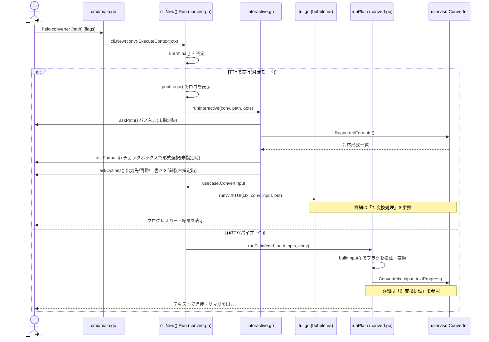
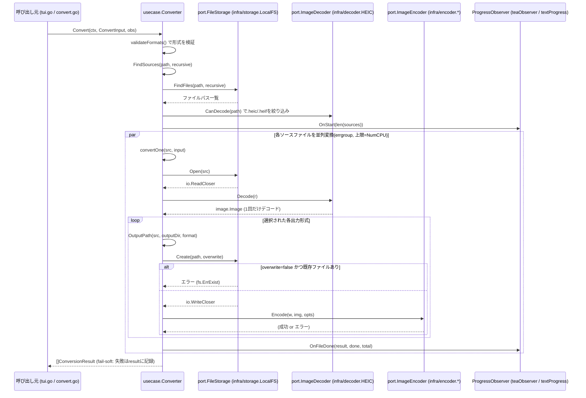

# 処理シーケンス図(CLI)

heic-converter CLIの処理フローをMermaidのシーケンス図で示す。実装は
[実装方針](./implementation-plan.md)のクリーンアーキテクチャ構成
(`cmd` → `presentation/cli` → `usecase` → `domain/port` ← `infra`)に対応する。

## 1. 起動〜モード分岐

`main`から`cli.New(conv).ExecuteContext`が呼ばれた後、標準入出力がTTYかどうかで
対話モード(リッチUI)と非対話モード(プレーンテキスト)に分岐する
(`internal/presentation/cli/convert.go`の`run`。コマンド定義は1コマンド=1ファイルで、
root.goはコマンドツリーの組み立てのみを行う)。

## 2. 変換処理(usecase.Converter.Convert)

対話・非対話いずれのモードでも、最終的に呼ばれる`Converter.Convert`の内部処理は
共通(`internal/usecase/convert.go`)。ProgressObserverの実装だけが
`teaObserver`(TUI)か`textProgress`(プレーン)かで切り替わる。

## ポイント

- **fail-soft**: 1ファイルの失敗(デコード失敗・既存ファイルなど)は`ConversionResult.Err`に記録されるだけで、他ファイルの変換や関数全体は止まらない
- **1回デコード・複数エンコード**: 複数形式を選択しても`Decode`は1回だけ実行し、結果を使い回して各`Encoder`に渡す
- **並列度**: `ConvertInput.Parallelism`が0以下の場合は`runtime.NumCPU()`が上限になる(`errgroup.SetLimit`)
- **層の依存方向**: `usecase.Converter`は`port.ImageDecoder` / `port.ImageEncoder` / `port.FileStorage`というinterfaceにのみ依存し、`infra`の具体実装(HEICデコーダやローカルFSなど)を知らない
