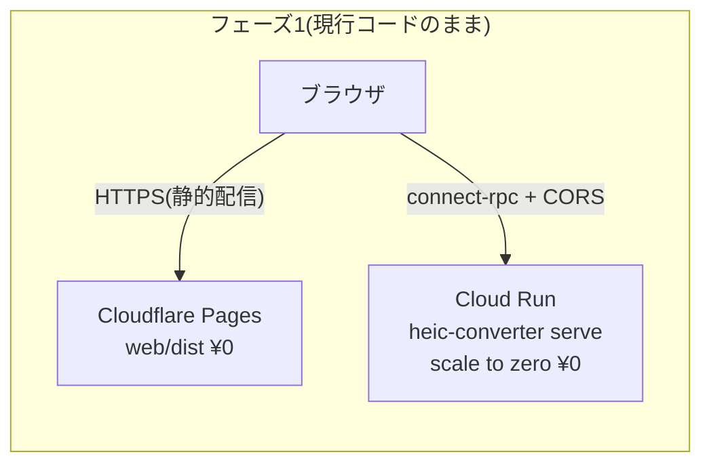
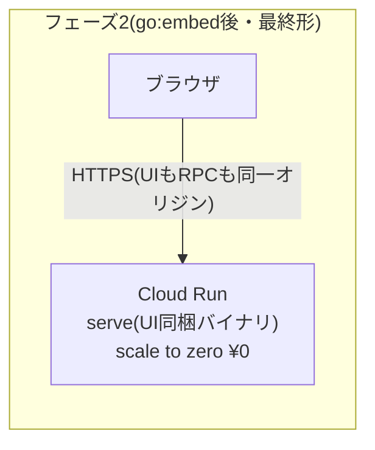
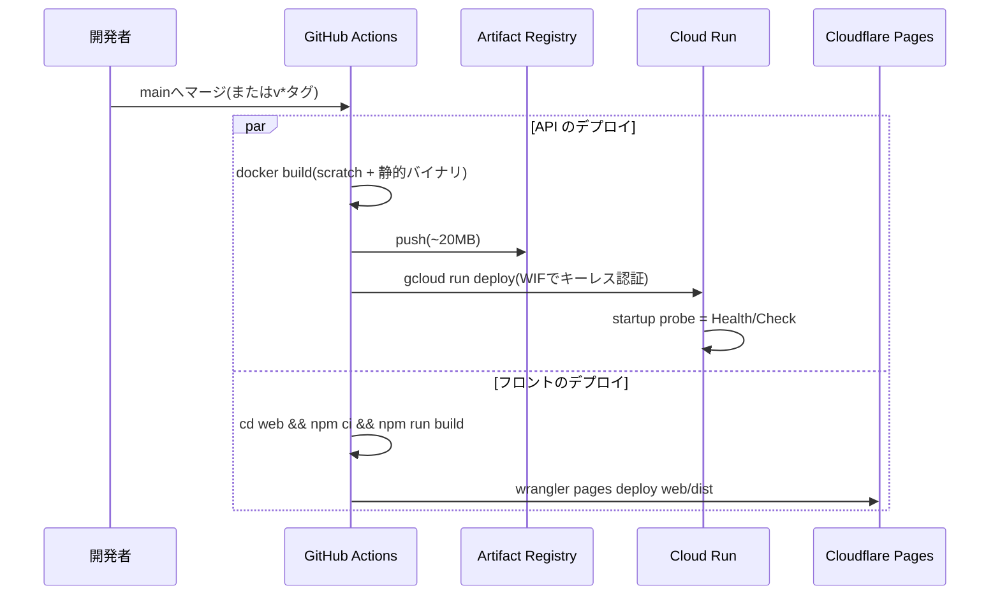

# インフラ設計 — ほぼ0円で運用するデプロイ構成

heic-converterのWeb版(フロントエンド + connect-rpcサーバー)を公開するためのインフラ設計。
**月額0円(上振れしても数十円)** を最優先の設計制約とする。

## 1. 前提と要求

| 項目 | 内容 |
|---|---|
| コスト | 月額0円目標。固定費(常時起動サーバー・有料プラン)は持たない |
| 構成要素 | フロント=静的ファイル(Vite成果物)、API=Goの単一バイナリ(ステートレス) |
| 状態 | **DB・ストレージ・セッションが一切ない**(変換結果はレスポンスで返して破棄) |
| 規模 | 個人利用〜小規模公開(月数百変換程度を想定) |
| HTTPS | 必須(Web Share APIがセキュアコンテキストでのみ動くため) |
| 前提PR | フロントエンド実装とserveのCORS対応(PR #7)がマージ済みであること |

このアプリの「完全ステートレス・単一バイナリ」という性質が0円運用の最大の武器になる。
**scale to zero(リクエストがない間はインスタンス0台=課金0)** できるサービスを選べば、
待機コストが構造的に発生しない。

## 2. 結論(推奨構成)

### フェーズ1: 現行コードのままデプロイ

- **フロント: Cloudflare Pages**(無料・帯域無制限・自動HTTPS)
- **API: Google Cloud Run**(無料枠・scale to zero・コンテナ1つ)
- 接続: フロント → Cloud RunへCORS越しにconnect-rpc(`--allowed-origins`で許可)

### フェーズ2(最終形): go:embedで1サービスに集約

Vite成果物をGoバイナリに埋め込み(フロントPRD §8の将来構想)、**Cloud Run 1サービスだけ**で
UIとAPIを同一オリジン配信する。CORS不要・デプロイ1本化・管理対象が1つになる。
どちらのフェーズも0円圏内なので、シンプルさを優先してフェーズ2へ進むことを推奨する。





ドメインは無料の `*.pages.dev` / `*.run.app` をそのまま使えば0円。
独自ドメインは任意(取得費 年1,000〜1,500円程度が唯一の固定費候補)。

## 3. API基盤の比較 — なぜCloud Runか

| 候補 | 月額 | scale to zero | 弱点 |
|---|---|---|---|
| **Cloud Run(推奨)** | **¥0**(無料枠内) | ✅(コールドスタート1秒前後) | egress無料枠が小さい(§4) |
| Render Free | ¥0 | ✅(ただし休止から復帰に**数十秒〜1分**) | 初回アクセスのUXが悪い |
| Koyeb Free | ¥0(1サービス) | ✅ | スペック小・実績少なめ |
| fly.io | 数百円〜 | △ | 無料枠が廃止され完全0円が困難 |
| Oracle Cloud Always Free VM | ¥0(ARM 4core/24GB) | ❌(常時起動) | TLS・OS更新・監視を自前運用。この規模には過剰 |
| 自宅マシン + Cloudflare Tunnel | ¥0 | ❌ | 常時起動前提・家庭回線依存 |
| Cloudflare Workers | ¥0 | ✅ | **Goバイナリが動かない**(WASM化の大改造が必要)で不適 |

Cloud Runを推す理由:

- 無料枠が恒久(Always Free)かつ十分: **月200万リクエスト・vCPU 18万秒・メモリ36万GiB秒**
- コンテナ=単一Goバイナリがそのまま動く。h2c対応済みなのでgRPCもそのまま通る
  (Cloud RunはHTTP/2エンドツーエンドに対応。`--use-http2`を有効化する)
- コールドスタートが軽い: scratchベースの~20MBイメージなら1秒前後で、変換アプリとして許容範囲
- ヘルスチェック(実装済みの`grpc.health.v1.Health`)をstartup probeにそのまま使える

フロント側の比較は簡単で、**Cloudflare Pagesが帯域無制限で無料**のため一択
(GitHub Pages/Vercel/Netlifyは月100GB制限。いずれにせよこの規模では差が出ない)。

## 4. 料金試算 — コストドライバーはegressだけ

変換処理のリソース消費(1画像あたり実測ベースの概算):

| リソース | 消費/変換 | 無料枠 | 無料枠でこなせる変換数 |
|---|---|---|---|
| リクエスト数 | 1 | 200万/月 | 200万 |
| vCPU | 1〜2秒 | 18万vCPU秒/月 | 約10万 |
| メモリ(512MiB設定) | 1〜2 GiB秒 | 36万GiB秒/月 | 事実上無制限 |
| **egress(下り転送)** | **数MB(変換結果)** | **1GiB/月(北米リージョン発)** | **約200〜300** |

つまりCPU・リクエスト数は事実上使い切れず、**唯一の課金リスクは変換結果のダウンロード転送量**。

- 月200変換程度(個人利用)なら完全に0円
- 超過しても $0.12/GB 程度 — 月1,000変換(約5GB)で**月約60〜90円**
- 無料egress枠は北米リージョン発のみのため、0円優先なら **us-west1等の北米リージョン** に置く。
  日本からのレイテンシは+100ms強だが、変換処理自体が秒単位なので体感影響は小さい。
  応答速度優先なら東京(asia-northeast1)にして数十円/月の egress を許容する
- その他: Artifact Registry(イメージ保存)は0.5GB無料 — イメージ~20MBなので古いタグを消せば0円。
  GitHub Actionsはパブリックリポジトリなら無料無制限。Cloud Loggingも50GiB/月無料

## 5. コスト暴走ガード(必ず設定する)

0円運用は「上限を機械的に縛る」ことで初めて成立する。デプロイ時に以下を必ず設定する:

| ガード | 設定 | 効果 |
|---|---|---|
| インスタンス上限 | `--max-instances=1` | スパイク・DoSでも水平スケールによる課金爆発が起きない |
| 同時実行数 | `--concurrency=4` 程度 | 1インスタンス内のメモリ圧迫を防ぐ |
| リクエストサイズ | `--max-request-bytes=33554432`(32MiB) | 巨大アップロードによるCPU/egress消費を抑制 |
| タイムアウト | Cloud Run側 60秒 | ハングしたリクエストの課金を打ち切る |
| 予算アラート | GCP Budgets で **¥100** に設定 | 想定外の課金を即検知(メール通知) |
| CORS | `--allowed-origins` を自サイトのみに | 他サイトのJSからAPIを濫用されない |

補足: CORSはブラウザ経由の濫用しか防げない(curl等の直叩きは防げない)。公開後に濫用が
観測されたら、Cloud Runの手前にCloudflare(無料プランのWAF/レートリミット)を挟むか、
簡易トークンをフロントに埋める対策を次の課題とする。

## 6. CI/CD

デプロイはGitHub Actionsに集約する。GCP認証は**Workload Identity Federation(キーレス)**を使い、
サービスアカウントキーをSecretsに置かない。



Dockerfileは多段ビルドで最小構成にする(イメージが小さいほどコールドスタートも速い):

```dockerfile
FROM golang:1.26 AS build
WORKDIR /src
COPY . .
RUN CGO_ENABLED=0 go build -ldflags="-s -w" -o /heic-converter ./cmd/heic-converter

FROM scratch
COPY --from=build /heic-converter /heic-converter
ENTRYPOINT ["/heic-converter", "serve"]
```

デプロイトリガーはCIの既存方針に合わせ、**mainへのマージで自動デプロイ**とする
(リリースタグ連動にしたければ既存のrelease.ymlに寄せる)。

## 7. フェーズ2への移行(go:embed)

実装タスク(小規模・1PR想定):

1. CIまたはMakefileで `npm run build` → `web/dist` を `internal/presentation/api/` 配下にコピー
2. `//go:embed` でdistを埋め込み、RPCパス以外へのリクエストにSPAを配信するハンドラを追加
   (`/heic.v1.*` / `/grpc.*` はconnect-rpcへ、それ以外は`index.html`フォールバック)
3. Cloudflare Pagesを廃止し、Cloud Run 1サービス構成へ

| 観点 | フェーズ1(分離) | フェーズ2(同梱) |
|---|---|---|
| 管理対象 | 2つ(Pages + Cloud Run) | **1つ** |
| CORS | 必要 | **不要(同一オリジン)** |
| 静的配信の転送量 | Pages(無制限無料) | Cloud Runのegressに乗る(JS/CSSは合計~100KB gzipなので影響軽微) |
| セルフホストの容易さ | 2コンポーネント | **バイナリ1つで完結**(単一バイナリ思想と一致) |

トラフィックが増えて静的配信のegressが無視できなくなったら、フェーズ1の分離構成に戻すか
Cloud Runの手前にCloudflareを挟んでキャッシュさせる。

## 8. 運用

- **監視**: Cloud Monitoringのuptime check(無料枠)で `GET /heic.v1.ConvertService/ListFormats?...` を定期確認
- **ログ**: 実装済みのslog構造化ログがそのままCloud Loggingに入る(50GiB/月無料)
- **TLS**: Cloud Run / Pagesが自動発行・更新(作業ゼロ)
- **リージョン障害**: 個人サービスのため多リージョン化はしない(コスト優先)。復旧はCIの再実行のみ
- **データ保護**: サーバーは画像を保存しないため、漏洩リスク面でも保持データがない。
  ログに画像データを出さないことは実装済み(interceptorはメタデータのみ記録)

## 9. デプロイ手順チェックリスト

- [ ] GCPプロジェクト作成、Cloud Run / Artifact Registry API有効化、予算アラート(¥100)設定
- [ ] Workload Identity FederationでGitHub Actionsを信頼するSAを作成
- [ ] Dockerfileとdeploy用ワークフローを追加(`--max-instances=1 --concurrency=4 --use-http2`)
- [ ] Cloudflare Pagesプロジェクト作成、`web/dist` のデプロイをワークフローに追加
- [ ] フロントの本番ビルドに `VITE_API_URL=<Cloud RunのURL>` を注入、serveに `--allowed-origins=<PagesのURL>` を設定
- [ ] iPhone実機で 変換 → 共有シート(メール添付 / Drive保存)を確認(フロントPRDの成功基準)
- [ ] フェーズ2: go:embed対応PRを作り、Pagesを廃止して1サービス化

## 関連ドキュメント

- [doc/frontend-web-ui/prd.md](../frontend-web-ui/prd.md) — フロントエンドの要件(揮発性ダウンロード・Web Share)
- [doc/connect-rpc-server/prd.md](../connect-rpc-server/prd.md) — サーバーの要件(ステートレス設計)
- [doc/architecture/clean-architecture-overview.md](../architecture/clean-architecture-overview.md) — 全体アーキテクチャ
