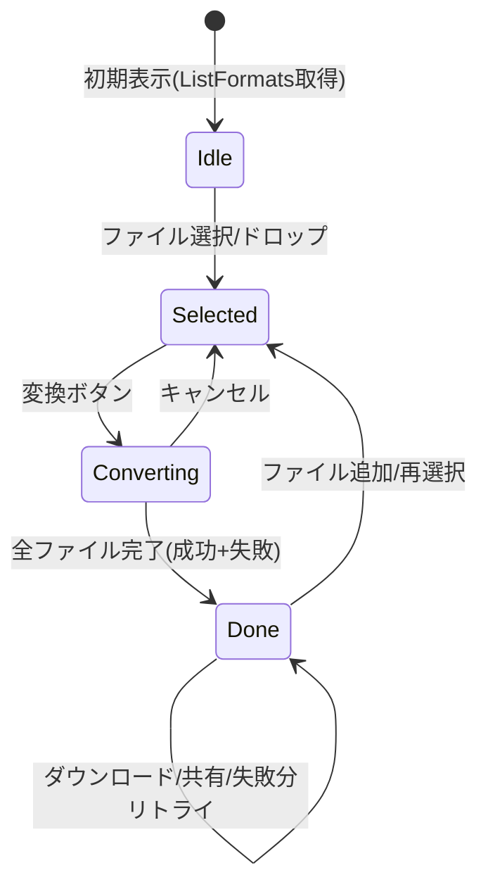
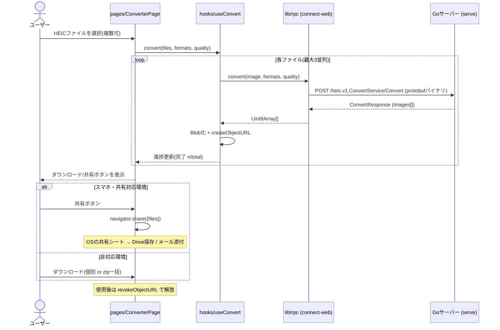

# PRD — フロントエンドWeb UI

heic-converterのWebフロントエンド。ブラウザからHEIC画像を選び、
[connect-rpcサーバー](../connect-rpc-server/prd.md)で変換し、結果をダウンロード・共有できるUIを提供する。

## 1. 背景・目的

CLIとWebサーバーモードは実装済みだが、サーバーを直接叩くにはcurlやgrpcurlの知識が必要で、
一般ユーザー(iPhoneで撮った写真を変換したい人)には使えない。
ブラウザだけで完結するUIを提供し、特に**スマホからの利用**を一級市民として扱う。

### ゴール

- HEICファイルを選んで形式を選ぶだけで変換できる、説明不要のUI
- スマホで「変換 → そのままGoogle Drive保存 / メール添付」まで行ける導線
- 変換画像をサーバーにもフロントにも永続化しない(揮発性モデルの徹底)

### 非ゴール(今回やらないこと)

- ユーザー認証・変換履歴の保存
- サーバーサイドでのメール送信・クラウドアップロード(必要になればGoサーバーのRPC追加で対応)
- SEO向けコンテンツページ(ランディングページは1枚のみ)

## 2. ユーザーストーリー

| # | ストーリー |
|---|---|
| US-1 | iPhoneユーザーとして、カメラロールのHEIC写真を選んでjpgに変換し、そのままメールに添付したい |
| US-2 | PCユーザーとして、HEICファイルをドラッグ&ドロップで複数まとめて変換し、zipでダウンロードしたい |
| US-3 | ユーザーとして、変換した写真をGoogle Driveなどのクラウドストレージに保存したい |
| US-4 | ユーザーとして、写真がサーバーに保存されないことを確認してから安心して使いたい |

## 3. 機能要件

### FR-1: ファイル選択

- ファイルピッカーとドラッグ&ドロップ(デスクトップ)の両対応
- `accept=".heic,.heif"` を指定しつつ、拡張子偽装に備えて選択後にもクライアント側で軽く検証する
- 複数ファイル選択に対応。スマホでは写真ライブラリから直接複数選択できる
- ファイルごとにサイズを表示し、サーバーの上限(protobufバイナリ転送のため実効約60MiB/枚)超過を送信前に警告する

### FR-2: 変換設定

- 出力形式はハードコードせず **`ListFormats` RPCから動的に取得**してチェックボックス表示する
  (CLIの対話モードと同じ思想。サーバーの対応形式が増えたらUIも自動で追従)
- 複数形式の同時選択可(1画像 × N形式)
- 品質スライダー(1-100、デフォルト90)。jpg / webp選択時のみ有効化する

### FR-3: 変換実行

- **1リクエスト = 1画像**(サーバーPRDの設計通り)。複数ファイルはクライアント側で並列にRPCを発行する
- 同時リクエスト数は制限する(目安: 3並列。サーバー・回線の圧迫を避ける)
- ファイル単位の進捗表示(待機中 / 変換中 / 完了 / 失敗)。CLIのfail-softと同様、
  1枚の失敗で全体を止めず、失敗したファイルだけ理由つきで表示してリトライ可能にする
- 変換中のキャンセル(AbortSignalでRPCを中断)

### FR-4: 結果の受け取りと揮発性ダウンロード

サーバーPRD §6 の揮発性モデルをそのまま実装する。

- レスポンスのバイト列を `Blob` 化し、`URL.createObjectURL` でダウンロードボタンを生成する
- ダウンロード・共有が済んだら(またはページ離脱時に)`revokeObjectURL` で確実に解放する
- 複数結果は**クライアント側でzip化**して一括ダウンロードできる(zipは無圧縮でよい。画像は再圧縮不要)
- 変換結果はメモリ上にのみ存在し、リロードで消えることをUI上に明示する

### FR-5: 共有 — クラウド保存・メール送信

「保存先を選ぶ」体験は **Web Share API(`navigator.share` + files)** で実現する。
OSの共有シートが開き、Google Drive / iCloud / Gmail / LINEなど**ユーザーが入れているアプリすべて**が
保存先・送信先になる。個別のクラウドAPI連携(OAuth)を実装せずにUS-1 / US-3を満たせるのが利点。

- `navigator.canShare({ files })` で対応判定し、対応環境でのみ共有ボタンを表示する
- 非対応環境(古いブラウザ・一部デスクトップ)ではダウンロードボタンにフォールバックする
- メール送信も共有シート経由(mailtoは添付ファイル非対応のため採用しない)

| 環境 | 共有シート | 備考 |
|---|---|---|
| iOS Safari 15+ | ✅ | Drive / iCloud / メール / LINE等へ |
| Android Chrome | ✅ | 同上 |
| macOS Safari | ✅ | AirDrop / メール等へ |
| Windows Chrome/Edge | ✅ (Win10+) | OSの共有UI |
| Firefox デスクトップ | ❌ | ダウンロードにフォールバック |

将来、特定クラウドへのダイレクト保存(Drive APIのOAuth連携など)が必要になれば追加する(§8)。

### FR-6: スマホ対応(モバイルファースト)

- ブレークポイントはモバイルファーストで設計し、スマホ1カラム / デスクトップ2カラム程度の単純な構成にする
- タップターゲットは44px以上、ドラッグ&ドロップ非対応環境でも導線が完結すること
- 縦長画面での操作順(選ぶ → 設定 → 変換 → 共有)が1画面のスクロールで自然に流れること

### FR-7: プライバシーの明示

- 「画像はサーバーに保存されません。変換後、結果はこのブラウザのメモリ上にのみ存在します」を画面に明記する
- 通信内容は変換リクエスト以外に送らない(アナリティクス等は入れない)

## 4. 画面構成

画面は1ページ完結のSPA。状態遷移で表示が変わる。



## 5. 処理シーケンス



## 6. 技術選定

| 項目 | 選定 | 理由 |
|---|---|---|
| ビルド/FW | **Vite + React + TypeScript** | 全機能がブラウザ内で完結するSPA。成果物が静的ファイルのみで、将来go:embedでバイナリ同梱可(§8) |
| RPCクライアント | **@connectrpc/connect-web** | 既存のproto(`proto/heic/v1`)から生成した型安全クライアントでConnectプロトコル(protobufバイナリ。base64膨張がなく転送量を約25%削減)を話す |
| コード生成 | **buf + protoc-gen-es** | 既存の`buf.gen.yaml`にTS出力を追加し、Go/TSを同一スキーマ・同一コマンドで生成 |
| UI設計 | **Atomic Design** | atoms → molecules → organisms → templates → pages の5階層(§7) |
| スタイリング | Tailwind CSS | モバイルファーストのレスポンシブをユーティリティで素早く。CSS-in-JSのランタイムコストを避ける |
| 状態管理 | Reactの標準機能(useState / useReducer + カスタムフック) | 1ページSPAに外部状態管理ライブラリは過剰。必要になってから導入を検討 |
| zip生成 | fflate | 軽量・依存なし。無圧縮zipで十分 |
| テスト | Vitest + Testing Library(+ Playwright E2E) | Vite標準のテストランナー。E2Eは主要フロー(選択→変換→DL)のみ |

### サーバー側への追加要件: CORS

connect-webはブラウザの`fetch`で通信するため、UIとAPIのオリジンが異なる構成では
**Goサーバー側にCORSヘッダの付与が必要**(現状の`serve`は未対応)。

- `connectrpc.com/cors` を利用してserveにCORSミドルウェアを追加する(許可オリジンはフラグで指定)
- 将来go:embedで同一オリジン配信にすればCORS自体が不要になる(§8)

## 7. ディレクトリ構成(Atomic Design)

同一リポジトリの `web/` 配下に置く。protoからの生成コードはGo側の`internal/gen`と対で`web/src/gen`に置く。

```
web/
  index.html
  vite.config.ts
  src/
    main.tsx
    gen/                 # buf generateによるTSクライアント(手で編集しない)
    lib/                 # RPCトランスポート・zip・share等のブラウザAPIラッパ
    hooks/               # useFormats / useConvert / useShare(状態とロジック)
    components/
      atoms/             # Button, Checkbox, Slider, Badge, Spinner ...
      molecules/         # FormatSelector, FileListItem, QualitySlider ...
      organisms/         # DropZone, FileList, ResultPanel ...
      templates/         # ConverterLayout(1カラム/2カラムの骨組み)
      pages/             # ConverterPage(状態とorganismsの結線)
```

設計方針はGo側と同じ思想で貫く:

- **components/はusecase(hooks)にのみ依存** — RPCやブラウザAPIの知識は`lib/`と`hooks/`に隔離し、
  atoms〜organismsは受け取ったpropsを描画するだけの純粋な部品にする
- 通信・共有・zipは`lib/`のモジュールに切り出し、hooksから注入可能にしてテスト容易性を確保する

## 8. 将来構想

- **go:embedによるバイナリ同梱** — `vite build`の成果物をGoバイナリに埋め込み、
  `heic-converter serve`だけでUI込みで配信(同一オリジンになりCORS不要化)
- PWA化(ホーム画面追加・オフラインでのUIキャッシュ)
- 特定クラウドへのダイレクト保存(Google Drive APIのOAuth連携)
- i18n(日本語/英語切り替え)

## 9. 成功基準

- [ ] iPhone実機で: 写真選択 → jpg変換 → 共有シートからメール添付/Drive保存 まで完了できる
- [ ] PCで: 複数HEICをドラッグ&ドロップ → 一括変換 → zip一括ダウンロードできる
- [ ] 1ファイルの変換失敗が他ファイルの結果に影響しない(fail-soft表示)
- [ ] 対応形式がサーバーの`ListFormats`と常に一致する(ハードコードなし)
- [ ] Lighthouseのモバイルスコア(Performance / Accessibility)90以上
- [ ] ユニットテスト(hooks / lib)+ 主要フローのE2Eが揃いカバレッジ80%以上
